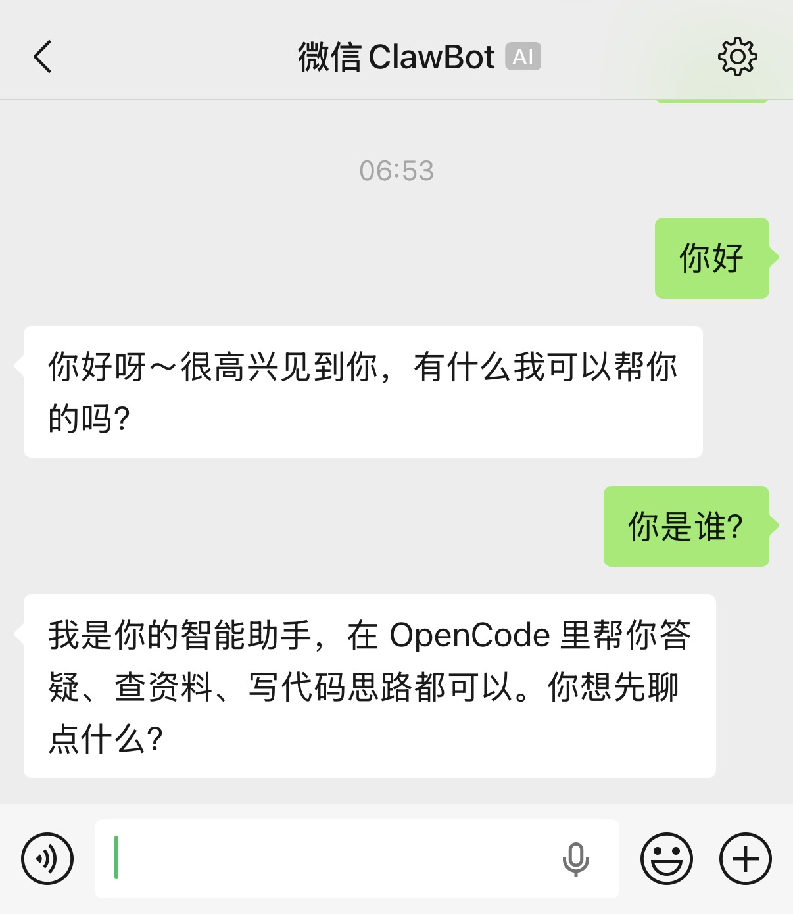
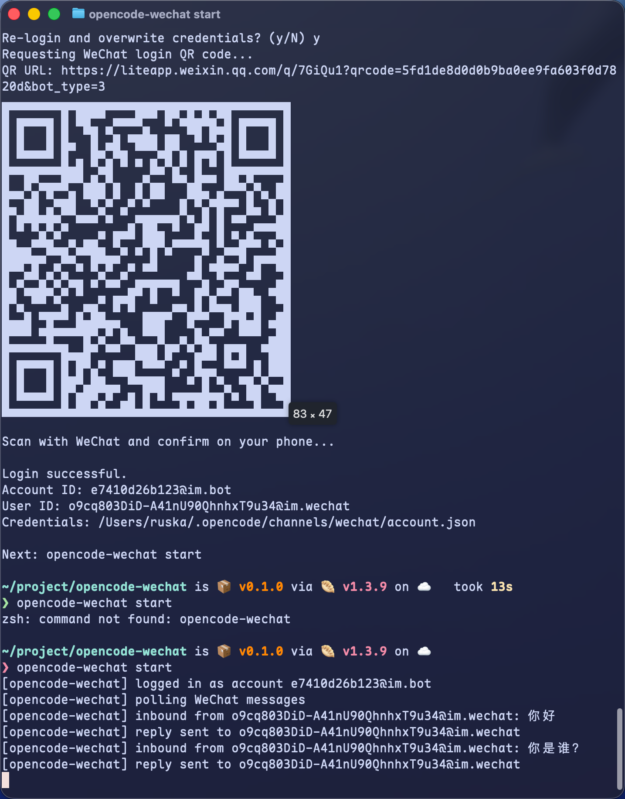
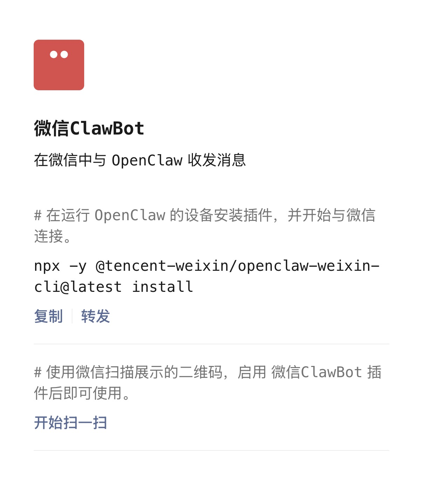

# opencode-wechat

`opencode-wechat` forwards WeChat ClawBot messages to OpenCode and sends OpenCode replies back to WeChat.

## Screenshots

<p align="center">
  
  
  
</p>

## Installation

### Requirements

- Node.js >= 18
- Bun >= 1.0 (for build)
- OpenCode CLI available in PATH (`opencode`)
- WeChat iOS with ClawBot enabled

### Setup

```bash
cd /Users/ruska/project/opencode-wechat
bun install
bun run build
npm link
```

After `npm link`, you can use `opencode-wechat` globally.

## Usage

### 1) Login with QR code

```bash
opencode-wechat setup
```

### 2) Start bridge process

```bash
opencode-wechat start
```

Keep the process running, then chat with your ClawBot contact in WeChat.

### Commands

- `opencode-wechat setup`
- `opencode-wechat start`
- `opencode-wechat help`

## Log Files

Log directory: `~/.opencode/channels/wechat/logs`

- Timing log: `~/.opencode/channels/wechat/logs/timing.log.jsonl`
- Conversation log: `~/.opencode/channels/wechat/logs/chat.log.jsonl`

### Quick view

```bash
cat ~/.opencode/channels/wechat/logs/timing.log.jsonl
cat ~/.opencode/channels/wechat/logs/chat.log.jsonl
```

### Time fields

- `ts_ms`: Unix timestamp in milliseconds
- `time_bj`: Beijing time

### Retention

- Both log files keep only the latest 24 hours.

## Common Environment Variables

- `OPENCODE_BIN`: OpenCode binary path (default: `opencode`)
- `OPENCODE_MODEL`: passed to `opencode run --model`
- `OPENCODE_AGENT`: passed to `opencode run --agent`
- `OPENCODE_WORKDIR`: passed to `opencode run --dir`
- `WECHAT_BASE_URL`: WeChat ilink API base URL
- `WECHAT_BOT_TYPE`: QR login bot type (default: `3`)
- `WECHAT_QR_MODE`: QR rendering mode (`small` or `ansi`)
- `OPENCODE_WECHAT_RUNTIME`: runtime (`node` or `bun`, default: `node`)
